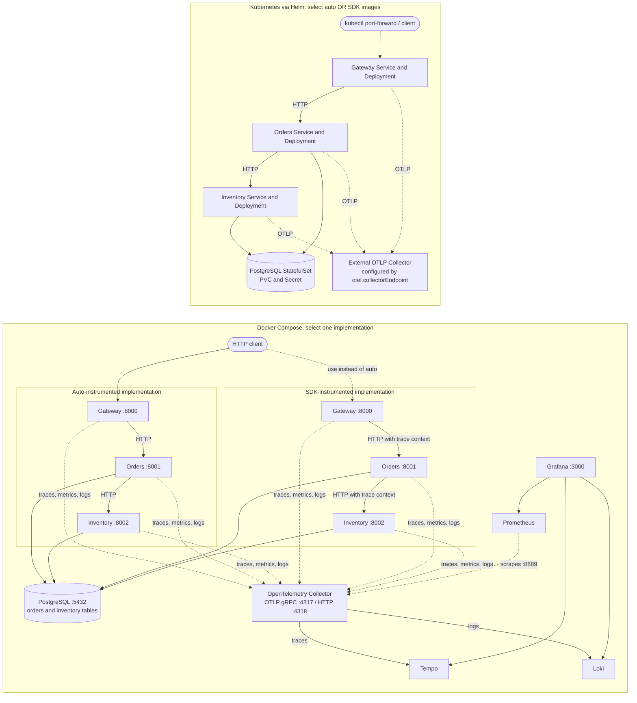

# Observability Lab

A hands-on Python, Flask, and PostgreSQL lab for distributed observability. It contains two behavior-matched versions of the same checkout application: OpenTelemetry auto-instrumentation and explicit SDK instrumentation.

## Architecture



Compose runs the full local learning stack: three Flask services, PostgreSQL, Collector, Tempo, Prometheus, Loki, and Grafana. The `auto` and `sdk` Compose configurations share service names, ports, and database; run one mode at a time. Helm deploys the selected app images and PostgreSQL only. Its Collector endpoint must be reachable from the Kubernetes cluster; Grafana and the telemetry backends are intentionally external to the chart.

| Implementation | How instrumentation works |
| --- | --- |
| Auto | `opentelemetry-instrument` starts Gunicorn and instruments Flask, Requests, psycopg, and logging. Application code does not configure SDK providers. |
| SDK | Application code configures OTEL providers/exporters and creates HTTP server/client, PostgreSQL, and business spans/metrics. Trace context is explicitly propagated in HTTP headers. |

## Run With Docker Compose

Requirements: Docker Engine and the Compose plugin. Auto mode is the default. From the repository root:

```sh
docker compose up --build -d
docker compose ps
```

If host port `5432` is occupied, set a free host port. This changes only the host mapping; apps continue to use `database:5432` inside Compose:

```sh
POSTGRES_HOST_PORT=55432 docker compose up --build -d
```

Wait until `gateway`, `orders`, `inventory`, and `database` are healthy. Submit a checkout:

```sh
curl -i http://localhost:8000/checkout \
	-H 'Content-Type: application/json' \
	-d '{"item_id":"widget","quantity":2}'
```

Copy the returned `order_id` into the order lookup, or inspect available stock:

```sh
curl http://localhost:8001/orders/ORDER_ID
curl http://localhost:8002/stock/widget
```

The inventory service seeds 20 widgets. A request for more than the remaining stock returns `409`; invalid quantities return `422`.

### Switch Instrumentation Mode

Stop the current Compose mode without deleting data, then start the other mode. The SDK override changes only app image/build configuration; the database and telemetry stack remain shared.

```sh
docker compose down
docker compose -f compose.yaml -f compose.sdk.yaml up --build -d
```

To switch back, run `docker compose down` and then `docker compose up --build -d`. If using a non-default PostgreSQL host port, set `POSTGRES_HOST_PORT` again on each `up` command.

## Explore Telemetry

- Grafana: <http://localhost:3000>, default login `admin` / `admin`. Set `GRAFANA_ADMIN_PASSWORD` to override the local password.
- Prometheus: <http://localhost:9090>. Query `http_server_duration_milliseconds_count`, `http_server_duration_milliseconds_bucket`, and `http_server_active_requests`. SDK mode additionally exports `checkout_requests_total`, `orders_created_total`, and `inventory_reservations_total`.
- Loki: in Grafana Explore, select Loki and query `{service_name="orders"}`. Use the log record's trace ID to find the corresponding trace.
- Tempo: in Grafana Explore, select Tempo and search for `checkout-gateway`. Follow the request through gateway, orders, inventory, and PostgreSQL spans.
- Collector zPages: <http://localhost:55679/debug/servicez>. Follow Collector logs with `docker compose logs -f otel-collector`.

Try these labs:

1. Compare one checkout trace in auto and SDK mode. Identify which Flask, HTTP-client, and database spans appear automatically versus which are explicitly named in code.
2. Correlate an `order created` log with its trace. Compare service name, namespace, environment, and trace ID.
3. Compare request count, error rate, and duration. Inspect SDK business counters and their bounded `outcome` labels; keep order IDs in traces/logs rather than metric labels.
4. Run `docker compose stop inventory`, submit a checkout, and inspect the failed downstream span and `502`. Restore inventory with `docker compose start inventory`.
5. Request more units than remain and follow the `409` through orders and gateway. Compare HTTP signals with the SDK rejection counter.
6. Follow an OTLP signal through Collector receiver, processor, and exporter. Experiment with processor and sampling settings.

## Run With Helm

The chart at `helm/observability-lab/` installs gateway, orders, inventory, and a persistent PostgreSQL StatefulSet. It does **not** install Collector, Prometheus, Tempo, Loki, or Grafana. Configure `otel.collectorEndpoint` to an OTLP/HTTP Collector address routable from the cluster. The default `lab` database credentials are for disposable learning environments only.

Lint and render both variants without a cluster:

```sh
helm lint helm/observability-lab
helm template learning-auto helm/observability-lab --set instrumentationMode=auto
helm template learning-sdk helm/observability-lab --set instrumentationMode=sdk
```

### Deploy To Local Kind

Create the cluster once and load the selected local images. For auto mode:

```sh
kind create cluster --name otel-lab
docker compose build
kind load docker-image observability-lab/gateway:auto observability-lab/orders:auto observability-lab/inventory:auto --name otel-lab
```

Install the chart. Replace the example Collector address with an endpoint reachable from your cluster:

```sh
helm upgrade --install lab helm/observability-lab \
	--namespace observability-lab --create-namespace \
	--set instrumentationMode=auto \
	--set-string otel.collectorEndpoint=http://otel-collector.observability.svc.cluster.local:4318

kubectl -n observability-lab get pods,svc,pvc
kubectl -n observability-lab port-forward svc/lab-observability-lab-gateway 8000:8000
```

Send the same `POST /checkout` request to `http://localhost:8000/checkout`. To switch the release to SDK mode, build/load those images and upgrade the instrumentation value:

```sh
docker compose -f compose.yaml -f compose.sdk.yaml build
kind load docker-image observability-lab/gateway:sdk observability-lab/orders:sdk observability-lab/inventory:sdk --name otel-lab
helm upgrade lab helm/observability-lab --namespace observability-lab --reuse-values --set instrumentationMode=sdk
```

The chart stores credentials in a Kubernetes Secret, but default values are still public demo credentials. Override them and use a secret manager outside a disposable cluster. The PostgreSQL PVC survives `helm uninstall`; delete it explicitly only if you intend to erase the database. For a remote cluster, publish images to a registry and override the image values instead of using `kind load`.

## Ports and Cleanup

| Component | Compose host address |
| --- | --- |
| Gateway / orders / inventory | `localhost:8000` / `localhost:8001` / `localhost:8002` |
| PostgreSQL | `localhost:5432` (or `POSTGRES_HOST_PORT`) |
| Grafana / Prometheus | <http://localhost:3000> / <http://localhost:9090> |
| Loki / Tempo | <http://localhost:3100> / <http://localhost:3200> |
| OTLP gRPC / HTTP | `localhost:4317` / `localhost:4318` |
| Collector zPages | <http://localhost:55679/debug/servicez> |

`docker compose down` stops Compose and keeps named volumes. `docker compose down -v` deletes the PostgreSQL data and observability history. The Compose defaults and Helm chart credentials are intended for local learning, not production.
